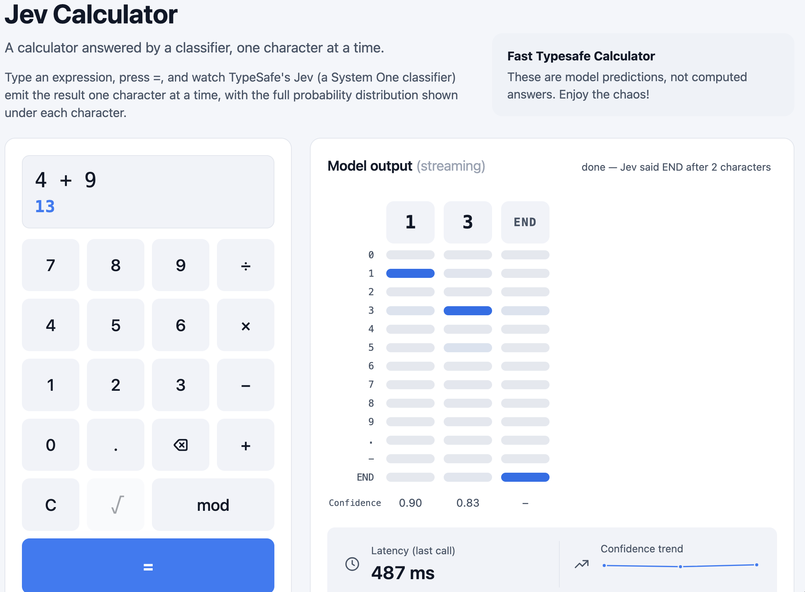

# Jev calculator

A calculator whose answer is produced by [TypeSafe](https://typesafe.ai)'s **Jev** classifier one
character at a time. Nothing in this repo evaluates arithmetic: every step Jev is offered the
same 13 options (`0`–`9`, `.`, `-`, `END`) and the page appends whatever it picks, then shows the full
probability distribution it assigned to each option, step by step.
Fast typesafe calculator powered by Jev!

Live: <https://jev-calculator.cloudflare-jjx3a.workers.dev>


## What you see

- **Calculator card**: keypad with `+ − × ÷ mod √`, decimals, operands up to 12 digits, answers up to 24
  characters. `=` starts a run, **Rerun** repeats the same expression so you can see the jitter between
  identical calls (the previous run stays visible as a ghost, with the first divergence marked).
- **Model output (streaming)**: one column per emitted character. Rows are the 13 options; each pill's
  colour intensity is the probability Jev gave that option at that step. The chosen option is solid.
  A Confidence row shows Jev's own confidence per step, plus the latency of the last call and a
  confidence sparkline.

Jev is not a calculator. Small sums, differences, square roots and `mod` often come out right. On large
products it gets the first two or three digits and then stops, because once the digit distribution goes
flat, `END` beats any single digit. That is the point of the demo, not a bug to file.

## How it works

```
browser ──POST /api/next {expression, prefix}──▶ Cloudflare Worker ──▶ Vercel AI Gateway ──▶ Jev
   ▲                                                     │ (on gateway 429 / transient failure)
   └── {choice, confidence, probabilities, …} ◀──────────┴──▶ TypeSafe API (fallback, own rate limit)
```

- The browser owns the autoregressive loop (`src/runner.ts`): it sends the wire expression and the answer
  so far, receives one choice plus the 13 probabilities, appends the choice verbatim, and repeats until
  `END` or the cap. State machine: `idle / running / paused / ended / capped / cancelled / error`.
  A gateway rate limit (429) pauses the run with a Resume button instead of retrying automatically.
- The Worker (`worker/index.ts`) validates the expression grammar and prefix alphabet, applies a per-IP
  rate limit, requires a same-origin request and a short-lived pass minted from a Cloudflare Turnstile
  token (`POST /api/pass`), then forwards a single System One "choice" request to Jev. Every option is
  always offered; nothing is masked, and the API's `choice` is used as returned, never an argmax.
- The prompt Jev receives is plain markdown in [`prompts/jev-prompts.md`](prompts/jev-prompts.md).
  `npm run prompts` regenerates `worker/prompts.ts` from it (also runs before `test` and `build`).
  Exactly one section is marked `(active)`; each section has `### state` templates using
  `{expression}` and `{prefix}`, `### instructions`, and `### criteria` listing all 13 options.

## Stack

Cloudflare Worker + static assets (`wrangler.jsonc`), Vite + vanilla TypeScript frontend, shared
contract in `shared/` (options, wire grammar, request/response types, keypad token model), Vitest with
a Node project for the pure modules and `@cloudflare/vitest-pool-workers` for the Worker.

## Develop

```sh
npm install
cp .dev.vars.example .dev.vars   # see "Configuration"; or create the file by hand
npm run dev                      # Vite on :5173 with /api proxied to wrangler dev on :8787
npx wrangler dev                 # in a second terminal
npm test                         # unit + workerd projects
npm run typecheck
npm run preview                  # build, then wrangler dev serving the built assets (closest to prod)
npm run deploy                   # build + wrangler deploy
```

## Configuration

Vars live in `wrangler.jsonc`: `JEV_BASE_URL` / `JEV_MODEL` (gateway), `TYPESAFE_BASE_URL` /
`TYPESAFE_MODEL` (direct fallback), `TURNSTILE_SITEKEY`, `TURNSTILE_HOSTNAMES`, `JEV_DISABLED` (kill
switch). Rate limits are Workers Rate Limiting bindings: `API_LIMIT` per IP and `FALLBACK_LIMIT` for
the direct route as a whole.

Secrets (never committed; `npx wrangler secret put <NAME>` in prod, `.dev.vars` locally):

| Secret | Purpose |
| --- | --- |
| `JEV_API_KEY` | Vercel AI Gateway key |
| `TYPESAFE_API_KEY` | direct TypeSafe key, used only when the gateway is rate-limited or failing; unset disables the fallback |
| `TURNSTILE_SECRET` | Turnstile siteverify secret; with the sitekey var unset, the bot check is off |
| `PASS_SECRET` | HMAC key for the 30-minute pass issued after a Turnstile check |

For local work use Cloudflare's always-pass Turnstile test keys and set `TURNSTILE_HOSTNAMES=example.com`,
which is the hostname the test secret reports.

## Limits and non-goals

- The gateway key is shared by every visitor and capped upstream; heavy use pauses runs, it does not
  queue them. The direct fallback has its own small budget and limiter.
- No true answer is computed or displayed, by design.
- Probabilities are shown as returned (two decimals, not renormalised), so a column may not sum to 1.
